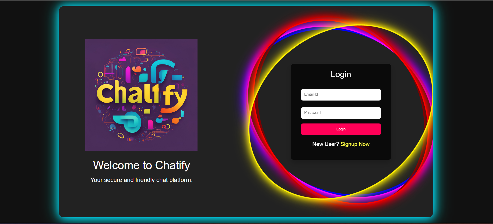
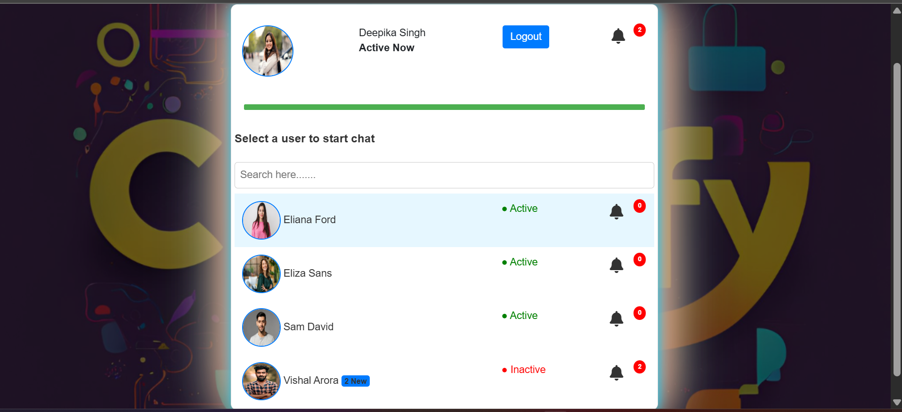

# 💬 Chatify - Realtime Chat Application


> **AWS LIVE:** [http://65.1.105.20](http://65.1.105.20)
> **LIVE DEMO:** [https://chatify-app.ddns.net](https://chatify-app.ddns.net)

## 🚀 About The Project

**Chatify** is a full-stack real-time messaging application designed to demonstrate modern DevOps and Cloud practices. It allows users to register, login, and exchange messages instantly.

The application is fully containerized using **Docker**, orchestration-ready with **Helm Charts**, and deployed on a live cloud environment using **AWS EC2**.

## 📸 Screenshots

<!-- You can upload images of your app here later. For now, this is a placeholder -->
| Login Page |
|  | 
| Dashboard |
| |

## 🛠️ Tech Stack

*   **Backend:** PHP 8.2 (Custom MVC Structure)
*   **Database:** MySQL 8.0
*   **Infrastructure:** Docker & Docker Compose
*   **Cloud Hosting:** AWS EC2 (Ubuntu Linux)
*   **Orchestration:** Helm Charts (Kubernetes Ready)
*   **Frontend:** HTML5, CSS3, JavaScript

## ✨ Key Features

*   ✅ **User Authentication:** Secure Login and Registration system.
*   ✅ **Containerized:** Runs identically on any machine using Docker.
*   ✅ **Database Integration:** Persistent data storage with MySQL volumes.
*   ✅ **Auto-Setup:** Database tables are created automatically on the first launch.
*   ✅ **Cloud Native:** Includes Helm charts for Kubernetes deployment.

## ⚙️ How to Run Locally

If you want to run this project on your own computer:

1.  **Clone the repository**
    ```bash
    git clone https://github.com/vivekshahi918/Chatify-App.git
    cd Chatify-App
    ```

2.  **Start with Docker Compose**
    ```bash
    docker-compose up -d --build
    ```

3.  **Access the App**
    *   Web App: `http://localhost:8080` (or Port 80 depending on config)
    *   Database GUI: `http://localhost:8081`

## ☁️ Deployment Details (AWS)

This project is currently live on **Amazon Web Services (AWS)**.
*   **Instance:** EC2 (t3.micro)
*   **OS:** Ubuntu Server 24.04 LTS
*   **Networking:** Static Elastic IP for consistent access.
*   **Security:** Configured Security Groups to allow HTTP (80) and Custom TCP (8081).

---
*Developed by Vivek Shahi*
